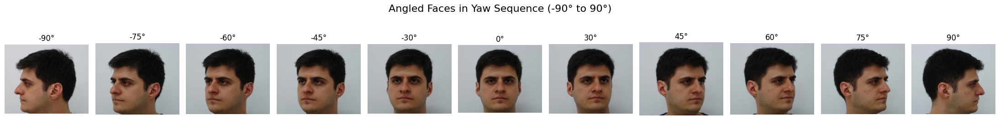

# Head Pose Estimation Benchmark on the FEI Face Dataset

A systematic evaluation of **6 head pose estimation methods** on the [FEI Face Database](https://fei.edu.br/~cet/facedatabase.html), covering classical geometry-based approaches, deep learning models, and hybrid pipelines. Each method is tested on 200 subjects across 11 head pose angles ranging from -90° to +90° yaw.

---

## Table of Contents

- [Motivation](#motivation)
- [Dataset](#dataset)
- [Methods](#methods)
- [Evaluation Metrics](#evaluation-metrics)
- [Results](#results)
- [Limitations & Future Work](#limitations--future-work)
- [Recommendation](#recommendation)

---

## Motivation

Head pose estimation is a foundational component in applications ranging from driver monitoring and attention detection to human-computer interaction and avatar animation. A large number of open-source implementations exist, each built on different architectural assumptions (landmark geometry, PnP solvers, deep regression, and gaze-based proxies), but direct comparisons on a common controlled dataset are rare.

This project benchmarks six publicly available head pose estimation approaches on the FEI Face Database, a well-structured dataset with known pose ordering, to answer a practical question: **which method is most reliable, and under what conditions does each one break down?**

---

## Dataset

**FEI Face Database:** a Brazilian face dataset collected at Fundação Educacional Incelênio (FEI), São Paulo.

| Property | Details |
|---|---|
| Subjects | 200 (100 male, 100 female) |
| Images per subject | 14 total; 11 used in this benchmark |
| Background | Uniform white, controlled lighting |
| Poses evaluated | -90°, -75°, -60°, -45°, -30°, 0°, +30°, +45°, +60°, +75°, +90° |
| Total images | 2,200 |

**Important note on ground truth:** The ±90° (full profile) and 0° (frontal) angles are true ground truth positions. The intermediate angles (±30°, ±45°, ±60°, ±75°) are approximate visual estimates after going through multiple images in the dataset manually. The ground truth is that the sequence is physically ordered, not that each angle is exactly as labelled. The primary evaluation metric is designed with this in mind.

*Illustration: Example montage from FEI Face Dataset (11 head poses, 1 subject). For more, see [dataset homepage](https://fei.edu.br/~cet/facedatabase.html).*

---

## Methods

| # | Notebook | Approach | Repo |
|---|---|---|---|
| 1 | `mtcnn_pnp.ipynb` | MTCNN landmarks + OpenCV solvePnP (6-point) | [Link](https://github.com/jerryhouuu/Face-Yaw-Roll-Pitch-from-Pose-Estimation-using-OpenCV) |
| 2 | `facepose_pytorch.ipynb` | PFLD 98-point landmarks + geometric yaw formula | [Link](https://github.com/WIKI2020/FacePose_pytorch) |
| 3 | `l2cs_gaze.ipynb` | L2CS-Net gaze estimation (ResNet50, Gaze360) | [Link](https://github.com/Ahmednull/L2CS-Net) |
| 4 | `liveportrait_headpose.ipynb` | LivePortrait internal motion descriptor | [Link](https://github.com/KwaiVGI/LivePortrait) |
| 5 | `mediapipe_pnp.ipynb` | MediaPipe 478-point landmarks + custom solvePnP | Self-contained ([MediaPipe Face Landmarker Docs](https://ai.google.dev/edge/mediapipe/solutions/vision/face_landmarker)) |
| 6 | `mediapipe_matrix.ipynb` | MediaPipe native facial transformation matrix | Self-contained ([MediaPipe Face Landmarker Docs](https://ai.google.dev/edge/mediapipe/solutions/vision/face_landmarker)) |

> **To run Notebooks 2, 3, and 4:** Clone the respective repository and place the notebook in the root of that directory. Model weights and dependencies must be set up as per each repo's instructions. Notebooks 1, 5, and 6 are self-contained.

---

## Evaluation Metrics

Three metrics are used to evaluate each method across the full dataset.

### 1. Monotonic Yaw Increase Check
Since the FEI dataset guarantees physically ordered head rotation from -90° to +90°, predicted yaw values should **strictly increase** across all 11 positions for each subject. Any non-increasing transition (where the model predicts the same angle or reverses direction) is counted as a break.

- **Total possible transitions:** 200 subjects × 10 steps = 2,000 (or 1,800 for notebooks excluding the frontal position from the sequence)
- **Lower breaks = better**
- This is the primary benchmark metric as it does not require exact angle calibration

### 2. Trimmed Mean per Position
The **10% trimmed mean** of predicted yaw, pitch, and roll at each ground truth position across all 200 subjects. Trimming removes the top and bottom 10% of values to reduce the influence of outliers.

- Yaw trimmed mean reveals calibration bias and compression
- Pitch and roll trimmed means evaluate stability: they should remain near zero across all yaw positions

### 3. Yaw Distribution Plots
Histogram + KDE plots of the full yaw distribution at each position, showing spread, standard deviation, and outlier structure. These reveal whether failures are systematic or random.

---

## Results

### Monotonic Increase Summary

| Method | Broken Transitions | Affected Subjects | Out of |
|---|---|---|---|
| **MediaPipe Native Matrix** | **11** | **11 / 200** | 1,800 |
| **L2CS Gaze** | **12** | **12 / 200** | 2,000 |
| LivePortrait | 39 | 34 / 200 | 1,800 |
| MediaPipe + PnP | 42 | 37 / 200 | 2,000 |
| MTCNN + PnP | 265 | 157 / 200 | 2,000 |
| FacePose_pytorch | 148 | 113 / 200 | 2,000 |

### Trimmed Mean Yaw at Key Positions

| Method | -90° | -45° | 0° | +45° | +90° |
|---|---|---|---|---|---|
| MTCNN + PnP | -61.88° | -21.91° | -1.59° | 26.01° | 57.76° |
| FacePose_pytorch | -51.44° | -25.74° | -2.27° | 27.74° | 46.90° |
| L2CS Gaze | -67.97° | -26.58° | -1.92° | 24.75° | 63.05° |
| LivePortrait | -62.54° | -19.78° | -1.25° | 21.94° | 59.90° |
| MediaPipe + PnP | -68.32° | -31.40° | 1.53° | 29.10° | 69.94° |
| MediaPipe Native Matrix | -47.24° ⚠️ | -16.71° | -1.13° | 18.94° | 46.56° |

> ⚠️ MediaPipe Native Matrix shows strong angle compression throughout. Values are consistent and monotonic but systematically underestimated.

### Pitch & Roll Stability (Trimmed Mean at 0°)

| Method | Pitch at 0° | Roll at 0° | Roll Available |
|---|---|---|---|
| MTCNN + PnP | 4.28° | 0.04° | ✅ |
| FacePose_pytorch | 3.79° | -0.41° | ✅ |
| L2CS Gaze | -1.80° | Not calculated | ❌ |
| LivePortrait | -0.23° | -0.52° | ✅ |
| MediaPipe + PnP | 7.95° | -1.30° | ✅ |
| MediaPipe Native Matrix | 3.05° | -0.91° | ✅ |

### Inference Speed

All benchmarks were run on an **OMEN 16 laptop** (Intel Core i5-11th Gen, RTX 3050 Ti 4GB, 16GB RAM) under consistent conditions.

| Method | Avg Time per Image | Relative Speed |
|---|---|---|
| MediaPipe Native Matrix | 0.0303s | Fastest |
| MediaPipe + PnP | 0.0304s | Fastest |
| FacePose_pytorch | 0.0856s | Fast |
| MTCNN + PnP | 0.1090s | Moderate |
| LivePortrait | 0.2081s | Slow |
| L2CS Gaze | 0.2097s | Slow |

The two MediaPipe approaches are nearly identical in speed since they share the same underlying detector and differ only in how pose is extracted from the result. FacePose_pytorch is the fastest deep learning method. MTCNN + PnP sits in the middle. LivePortrait and L2CS are roughly 7x slower than the MediaPipe approaches, reflecting the heavier ResNet50 and motion encoder backbones they run internally.

### Distribution Std at Frontal (0°): Consistency Indicator

| Method | Std at 0° |
|---|---|
| MediaPipe Native Matrix | **2.52°** |
| L2CS Gaze | 2.35° |
| LivePortrait | 3.30° |
| MediaPipe + PnP | 4.69° |
| FacePose_pytorch | 6.19° |
| MTCNN + PnP | 6.78° |

---

## Limitations

**Dataset limitations:** The FEI dataset is collected in a controlled lab environment with uniform backgrounds and consistent lighting. Results may not generalise to in-the-wild conditions with occlusion, varied lighting, or non-frontal camera setups. Ground truth angles for intermediate poses are approximations, not precise measurements.

**Gaze vs head pose:** L2CS-Net is a gaze estimation model, not a head pose model. Its strong performance here is a consequence of the FEI dataset's controlled setup where subjects look directly at the camera. In real-world scenarios where gaze and head orientation diverge, L2CS would measure eye direction rather than head pose.

**Angle compression:** Most methods underestimate yaw magnitude at extreme angles (±75°, ±90°). This is a shared limitation of single-camera pose estimation: as the face approaches profile, geometric cues become ambiguous and deep models trained on non-uniform angle distributions tend to regress toward the mean. The MediaPipe native matrix exhibits the most severe compression and would require post-hoc calibration for applications needing accurate absolute angles.

**Roll at extreme yaw:** Several PnP-based methods show significant roll-yaw coupling at ±90°, a known consequence of Euler angle decomposition near gimbal lock. This is an artefact of the decomposition convention rather than a true estimation error.

---

## Recommendation

For most use cases requiring reliable head pose estimation out of the box, **MediaPipe Native Transformation Matrix** is the overall recommended method and the clear winner of this benchmark when all factors are considered together.

It achieves the best monotonicity (11 breaks), the tightest frontal distribution (std=2.52°), the most stable roll of any method with full roll/pitch/yaw output, near-perfect ordering consistency across all 200 subjects, and is the joint fastest method at 0.0303s per image. Its one meaningful limitation is **significant angle compression**: predicted yaw values are systematically smaller than true angles, particularly at extremes (predicting ~47° at true 90°). For applications requiring accurate absolute angles, a simple linear calibration step against known reference angles resolves this.

**L2CS-Net** is the runner-up on accuracy metrics alone (12 breaks, best absolute yaw range coverage at extremes, excellent pitch stability), but comes with two important caveats: it is 7x slower at 0.2097s per image, and it measures **gaze direction rather than head orientation**. In the controlled FEI dataset these align closely, but in real-world use where a subject looks in a different direction from their head orientation, L2CS will report gaze angle rather than head pose. It is the right choice only when gaze-camera alignment can be assumed.

**MediaPipe + PnP (Notebook 5)** is the best choice when accurate absolute yaw values are required without calibration. It reaches ~70° at true ±90°, the closest to ground truth of any method, with competitive monotonicity (42 breaks) and the same fast 0.0304s inference time as the native matrix approach. The trade-off is a persistent ~8° pitch bias across all positions that would need to be corrected for multi-axis applications.

The two PnP-based approaches (MTCNN and FacePose_pytorch) and LivePortrait are not recommended as primary choices given their higher break counts and no compensating advantages in speed or calibration.

---
 
## Contributing a New Benchmark
 
If you have tested a head pose estimation method on the FEI dataset using the same evaluation pipeline and want to add it to this benchmark, contributions are welcome via pull request.
 
### What to Include
 
Your pull request should contain:
 
1. **A notebook** following the same structure as the existing six. It should include:
   - A header cell describing the method and linking to the source repo
   - The full dataset processing loop producing `person_pose`, `yaw_angles_by_position`, `pitch_angles_by_position`, and `roll_angles_by_position`
   - The monotonic yaw increase check with printed output
   - The trimmed mean table for all 11 positions
   - The yaw distribution plots for all 11 positions
   - Markdown annotation cells before each major section following the style of the existing notebooks
 
2. **Your metric outputs** included as printed output or as a results cell in the notebook so they are visible without re-running.
 
3. **An update to this README** adding your method to all four results tables (monotonic increase, trimmed mean yaw, pitch and roll stability, and distribution std at frontal) and to the methods table with a link to the source repo.
 
### Steps to Submit
 
1. Fork this repository
2. Create a new branch with a descriptive name, for example `benchmark/hopenet` or `benchmark/sixdrepnet`
3. Add your notebook to the root of the repository
4. Update the README tables with your results
5. Open a pull request with a short description of the method, the source repo, and a one-line summary of your key finding
 
### Requirements for Consistency
 
To keep results comparable across methods:
 
- Use the same FEI dataset with the same filename convention (`{person_id}-{position_index}.jpg`)
- Use the same 11 positions and the same `positions_order` list as the existing notebooks
- Use `trim_fraction = 0.1` for all trimmed mean calculations
- Report inference time averaged over the full dataset on your hardware, and include your hardware specs
- If your method does not compute roll, set roll to 0 and note this clearly in your notebook header
